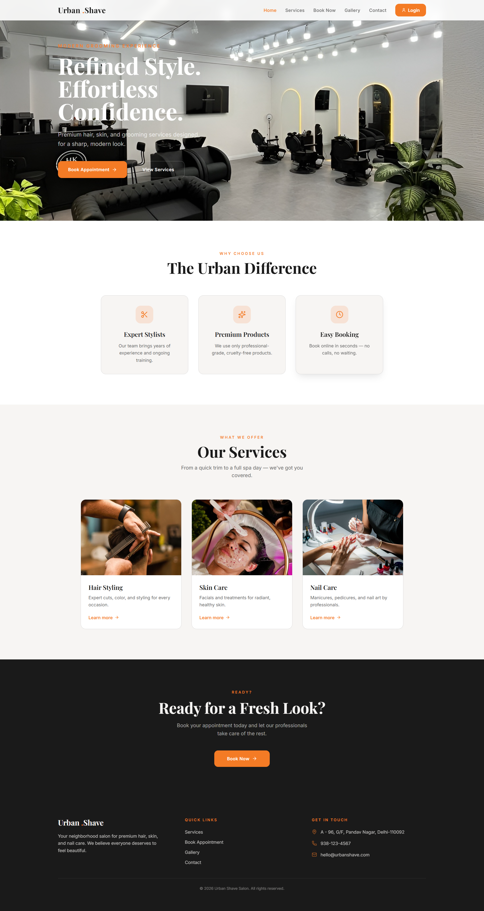

# 💈 Urban Shave – Salon Management System

A modern, clean, and user-friendly **Salon Management System website** that allows customers to book appointments online and enables salon owners to manage bookings efficiently through an admin panel.

---

## 🚀 Overview

Urban Shave is a web-based application designed to simplify salon operations and improve customer experience.
It replaces manual booking systems with a digital solution that is fast, organized, and easy to use.

---

## ✨ Features

### 👤 User Side

* User Signup & Login (Authentication)
* Book salon appointments
* View personal booking history
* Clean and responsive UI

### 🧑‍💼 Admin Panel

* Secure admin login
* View all user bookings
* Update appointment status (Pending / Done)
* Delete or manage bookings

---

## 🛠️ Tech Stack

### Frontend

* React (Vite)
* TypeScript
* Tailwind CSS
* ShadCN UI

### Backend / Database

* Supabase (Auth + Database)

---

## 📁 Project Structure

```
salonbloom-suite/
│
├── public/                # Static files
├── src/
│   ├── components/        # Reusable UI components
│   ├── pages/             # Main pages (Home, Booking, Admin, etc.)
│   ├── lib/               # Services & utilities
│   ├── integrations/      # Supabase integration
│   └── main.tsx           # App entry point
│
├── package.json
└── README.md
```

---

## ⚙️ Installation & Setup

1. Clone the repository

```
git clone https://github.com/YOUR_USERNAME/urban-shave-salon.git
```

2. Navigate to project folder

```
cd salonbloom-suite
```

3. Install dependencies

```
npm install
```

4. Run development server

```
npm run dev
```

5. Open in browser

```
http://localhost:8080/
```

---

## 🔐 Environment Setup

Create a `.env` file and add your Supabase credentials:

```
VITE_SUPABASE_URL=your_url
VITE_SUPABASE_ANON_KEY=your_key
```

---

## 🎨 UI Highlights

* Minimal and modern design
* Glassmorphism login UI
* Smooth hover animations
* Responsive layout (mobile-friendly)

---

## 📌 Use Case

This system is ideal for:

* Small to medium salon businesses
* Appointment-based service providers
* Portfolio demonstration for web development projects

---

## 🚧 Limitations

* No online payment integration
* No real-time notifications
* Single salon system (no multi-branch support)

---

## 🔮 Future Improvements

* Online payment (Razorpay / Stripe)
* Email & SMS notifications
* Advanced admin analytics dashboard
* Multi-user role management
* Mobile app version

---

## 📸 Screenshots

(Add screenshots of your website here)


---

## 📄 License

This project is for educational purposes.

---

## 🙌 Author

Developed by **Vishal**
BCA Final Year Project
